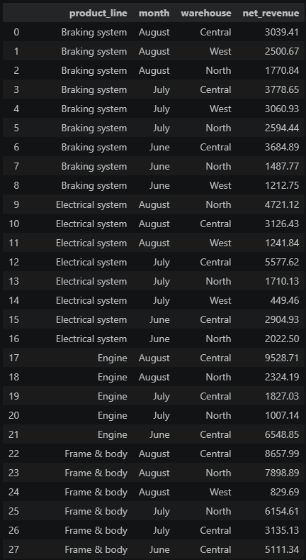
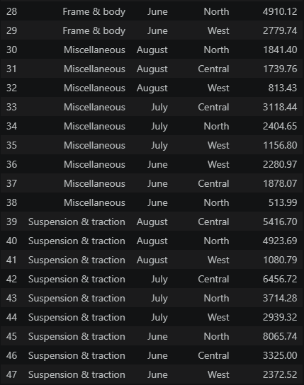

# Motorcycle Parts Wholesale Revenue & Logistics Analysis


## 📌 Executive Summary
A motorcycle parts distributor operating across three regional warehouses (`Central`, `North`, `West`) required visibility into its wholesale revenue performance. Because payment processing fees vary by transaction channel (credit card, bank transfer, and cash), the board of directors needed net revenue calculated across individual product lines, calendar months, and fulfillment facilities.

Using aggregation functions, date formatting, and row filtering on the transactional `sales` table, this analysis isolates wholesale transactions from June to August 2021. The findings highlight high-yield categories—notably **Engine**, **Frame & body**, and **Suspension & traction**—and pinpoint warehouse-level performance variations across operational cycles.

---

## 📂 Data Schema
The analysis was performed on the transactional `sales` database table containing operational and billing attributes:

* **`order_number`**: Unique order tracking identifier (`VARCHAR`).
* **`date`**: Transaction timestamp spanning June to August 2021 (`DATE`).
* **`warehouse`**: Regional fulfillment hub (`Central`, `North`, or `West`) (`VARCHAR`).
* **`client_type`**: Customer segmentation tier (`Retail` or `Wholesale`) (`VARCHAR`).
* **`product_line`**: Product family catalog designation (`VARCHAR`).
* **`quantity`**: Total units fulfilled per line item (`INT`).
* **`unit_price`**: Baseline price per unit in USD (`FLOAT`).
* **`total`**: Gross transaction invoice amount in USD (`FLOAT`).
* **`payment`**: Settlement method (`Credit card`, `Transfer`, `Cash`) (`VARCHAR`).
* **`payment_fee`**: Payment gateway fee assessed on total order value (`FLOAT`).

---

## 🛠️ Technical Implementation & SQL Concepts
The query applies several foundational SQL data transformation techniques:
* **Cohort Filtering**: Filtered order records using `WHERE client_type = 'Wholesale'` to exclude direct-to-consumer retail traffic.
* **Date Parsing & Formatting**: Applied PostgreSQL's `TO_CHAR(date, 'Month')` to convert order dates into standard month names.
* **Net Revenue Modeling**: Calculated net receipts by deducting aggregate payment processing fees from total transaction values (`SUM(total) - SUM(payment_fee)`).
* **Multi-Dimensional Grouping & Sorting**: Consolidated metrics using `GROUP BY product_line, TO_CHAR(date, 'Month'), warehouse` and ordered by category, month, and descending net revenue.

```sql
SELECT 
    product_line, 
    TO_CHAR(date, 'Month') AS month, 
    warehouse,  
    SUM(total) - SUM(payment_fee) AS net_revenue
FROM public.sales
WHERE client_type = 'Wholesale'
GROUP BY product_line, TO_CHAR(date, 'Month'), warehouse
ORDER BY product_line, month, net_revenue DESC;
```

---

## 📊 Query Output




*Figure 1: Query Output — Wholesale Net Revenue by Product Line, Month, and Regional Warehouse (June–August 2021).*

---

## 🔍 Key Strategic Insights
1. **Engine Segment Outperformance**: The **Engine** product line delivered the highest single-month warehouse revenue, reaching **$9,528.71** at the Central warehouse in August 2021.
2. **Central Hub Dominance**: Across high-value categories (**Frame & body**, **Engine**, and **Electrical system**), the **Central** warehouse consistently captured the highest net wholesale margins, identifying it as the company's primary distribution backbone.
3. **Inventory & Logistics Allocation**: Lower-margin lines such as **Miscellaneous** generated lower net revenues across all months (<$3,200), suggesting management should prioritize warehouse square footage and logistics support for **Frame & body** and **Suspension & traction** product groups.

---
*© 2026 Ryan Tang.*
